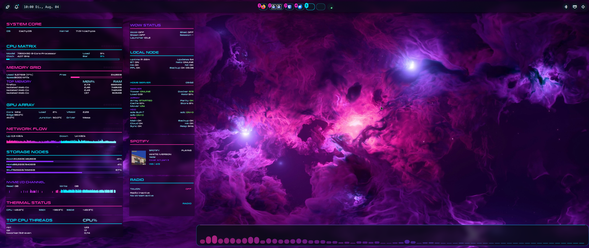

## Screenshot

# m4j0r.one Dotfiles

My personal CachyOS and Niri desktop configuration.

This repository contains the configuration behind my current desktop setup,
including Niri, Noctalia, Ghostty, Walker, Fastfetch, Quickshell and a modular
Conky dashboard.

> This is a snapshot of my personal setup, not a universal one-command
> installer. Some paths, displays and system-specific modules need to be
> adjusted before use.

## Included components

- Niri configuration with modular KDL files
- Noctalia settings
- Ghostty configuration and custom cursor shader
- Walker configuration and custom theme
- Fastfetch configurations and artwork
- Quickshell/CAVA audio visualizer
- Modular Conky dashboard
- Spotify and Tauon artwork helpers
- Custom utility scripts

## Repository structure

    .
    ├── config/
    │   ├── cava/
    │   ├── fastfetch/
    │   ├── ghostty/
    │   ├── niri/
    │   ├── noctalia/
    │   ├── quickshell/
    │   └── walker/
    ├── local/
    │   ├── bin/
    │   └── share/
    └── scripts/
        └── conky/

## Installation paths

| Repository path | Target location |
| --- | --- |
| `config/niri` | `~/.config/niri` |
| `config/ghostty` | `~/.config/ghostty` |
| `config/noctalia` | `~/.config/noctalia` |
| `config/walker` | `~/.config/walker` |
| `config/fastfetch` | `~/.config/fastfetch` |
| `config/quickshell` | `~/.config/quickshell` |
| `config/cava` | `~/.config/cava` |
| `local/bin` | `~/.local/bin` |
| `local/share` | `~/.local/share` |
| `scripts/conky` | `~/scripts/Conky` |

Back up your existing configuration before copying anything.

## Required customization

Search the repository for these placeholders:

    YOUR_USERNAME
    YOUR_SERVER_IP

You should also review:

- `config/niri/cfg/display.kdl` for monitor names and resolutions
- `config/niri/cfg/autostart.kdl` for personal startup applications
- `config/niri/cfg/keybinds.kdl` for application paths
- `config/noctalia/settings.json` for wallpaper and avatar paths
- the Conky storage, backup and home-server cards
- font names used by Ghostty, Walker, Fastfetch and Conky

The supplied Niri configuration is designed around two displays named
`DP-1` and `DP-2`.

## Conky notes

The dashboard contains several machine-specific modules. Cards related to
storage, backups and home-server monitoring require local customization.

The custom Conky binary used on my system is not included. The startup script
first checks:

    ~/.local/opt/conky-niri/bin/conky

If that executable is unavailable, it falls back to the regular `conky`
command from the system.

## Status

This is the first public version prepared for sharing. Documentation and
installation helpers may be expanded over time.

## m4j0r.one Community

A German-speaking, beginner-friendly community around Python, Linux,
automation, homelabs and open source.

**Gemeinsam lernen. Gemeinsam bauen. Menschlich bleiben.**

- Website: https://m4j0r.one
- Instagram: https://www.instagram.com/m4j0r_0ne

## License

Configuration files, scripts and source code are available under the
[MIT License](LICENSE).

Logos, branding and artwork are excluded from the MIT License. See
[ASSETS.md](ASSETS.md) for details.
